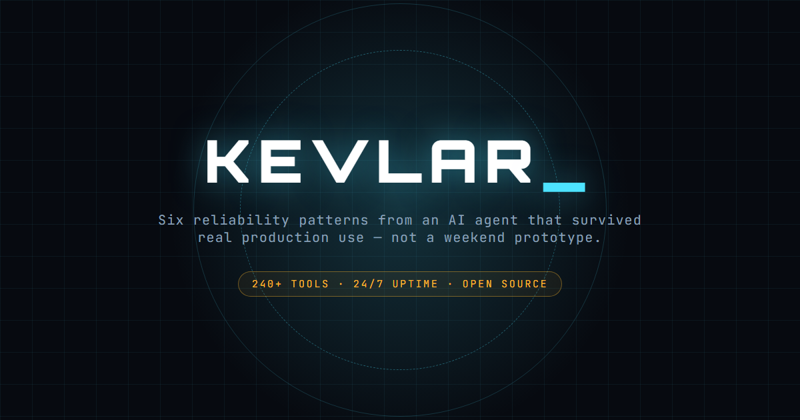

<p align="center">
  
</p>

# KEVLAR

[](https://pypi.org/project/kevlar-agent/)
[](https://github.com/KiitaInternet/kevlar/actions/workflows/tests.yml)
[](https://pypi.org/project/kevlar-agent/)
[](./LICENSE)
[](https://ko-fi.com/kiita1302)

**A case study in what it actually takes to keep a voice-driven AI agent running, unattended, for months.**

Most agent frameworks optimize for the demo: wire up a tool, watch it call an API, ship it. KEVLAR is the opposite kind of artifact — a single-page write-up of the reliability patterns that only show up after an agent has been left running against real usage, real API quotas, and real unattended background jobs long enough for the unglamorous failure modes to surface.

**[Live case study →](https://kiitainternet.github.io/kevlar/)** · **[`pip install kevlar-agent`](./PACKAGE_README.md)** — the six patterns below, as a real, tested, installable library.

## Why this exists

Every pattern documented on the page traces back to a real failure, not a hypothetical one:

- An OAuth helper that opened a browser and waited for a human click — called from a background thread with no human anywhere near it. It hung for hours.
- Two rapid duplicate tool calls in the same turn that spun up two concurrent live sessions on the same device.
- One shared API key silently starving a second feature of quota mid-conversation because nothing isolated their spend.

None of that shows up in a framework's quickstart. It only shows up in production, after enough real hours logged. This page is what that experience distilled into reusable patterns looks like.

## What's here

A single self-contained `index.html` — no build step, no dependencies, no framework. Open it in a browser or drop it on any static host.

- An original, hand-authored animated HUD visual (Canvas 2D — no external asset, no template)
- Six documented reliability patterns, each with the failure mode that motivated it
- A system-shape diagram showing how one audited dispatch core serves multiple front-end channels
- A simulated self-check terminal sequence

## Stack

**The case study page**: plain HTML/CSS/JS, Google Fonts (Orbitron, Rajdhani, IBM Plex Sans, JetBrains Mono). No frameworks, no bundler, no build step — intentionally, so anyone can read the entire implementation top to bottom in one file.

**The library** (`kevlar_agent/`): zero-dependency Python (one optional dependency, `psutil`, for the watchdog's default liveness check). 24 tests, all passing — see [PACKAGE_README.md](./PACKAGE_README.md) for usage.

```bash
pip install kevlar-agent
```

```bash
# to run the test suite yourself
pip install -e ".[dev]"
pytest
```

## Support

If this saved you a debugging session, a [tip on Ko-fi](https://ko-fi.com/kiita1302) or a [GitHub Sponsor](https://github.com/sponsors/KiitaInternet) goes a long way — both entirely optional.

## License

MIT — see [LICENSE](./LICENSE).
